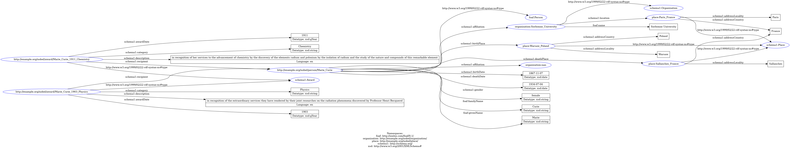

# 🌐 Projet Web Sémantique — Prix Nobel RDF

## Présentation

Ce projet transforme un fichier CSV contenant les informations des lauréats du **Prix Nobel** en un graphe **RDF** au format **Turtle**, interrogeable via **SPARQL** sur un serveur local [Apache Jena Fuseki](https://jena.apache.org/documentation/fuseki2/).

---

## Prérequis et installation

Prérequis côté machine :

- Python 3.10+ (testé avec 3.12)
- pip (installé avec Python)

Installer les dépendances Python :

```powershell
pip install -r .\requirements.txt
```

Packages utilisés :

- `pandas` pour lire le CSV
- `rdflib` pour construire et sérialiser le graphe RDF

## Conversion CSV → RDF

Le script `converter.py` lit le fichier CSV et génère automatiquement un fichier `out.ttl` :

```bash
python3 converter.py
```

Le fichier TTL peut ensuite être importé dans un serveur local comme Fuseki pour exécuter des requêtes SPARQL.

---

## Modélisation RDF

Ce jeu de données RDF repose sur deux vocabulaires principaux :

- [`schema.org`](https://schema.org/) : pour les entités Personne, Organisation, Récompense et Lieu  
- [`FOAF`](http://xmlns.com/foaf/spec/) : pour la modélisation des noms propres (personnes et organisations)

---

### Types d’entités et URI générées

| Élément        | Classe RDF             | Exemple d'URI                                    |
|---------------|-------------------------|--------------------------------------------------|
| Lauréat       | `foaf:Person`           | `nobel:person/Marie_Curie`                      |
| Récompense    | `schema:Award`          | `nobel:award/Marie_Curie_1911_Chemistry`        |
| Lieu          | `schema:Place`          | `place:Born_Paris_France`                       |
| Organisation  | `schema:Organization`   | `organization:Sorbonne`                         |

---

### Personne (`foaf:Person`)

URI : `nobel:person/<firstname_surname>`

| Propriété               | Namespace   | Type de valeur                  | Description |
|-------------------------|------------|----------------------------------|-------------|
| `rdf:type`             | `rdf`      | URI (`foaf:Person`)            | Typage de la ressource comme une personne |
| `foaf:givenName`       | `foaf`     | Literal (`xsd:string`)         | Prénom |
| `foaf:familyName`      | `foaf`     | Literal (`xsd:string`)         | Nom de famille |
| `schema:birthDate`     | `schema`   | Literal (`xsd:date`)           | Date de naissance |
| `schema:deathDate`     | `schema`   | Literal (`xsd:date`)           | Date de décès |
| `schema:gender`        | `schema`   | Literal (`xsd:string`)         | Genre (`male`, `female`) |
| `schema:birthPlace`    | `schema`   | URI → `schema:Place`          | Lieu de naissance |
| `schema:deathPlace`    | `schema`   | URI → `schema:Place`          | Lieu de décès |
| `schema:affiliation`   | `schema`   | URI → `schema:Organization`   | Organisation(s) affiliée(s) au moment du prix |

> Une personne peut avoir plusieurs organisations (notemment si elle a reçu plusieurs prix)

---

### Récompense (`schema:Award`)

URI : `nobel:award/<name>_<year>_<category>`

| Propriété                | Namespace   | Type de valeur                    | Description |
|--------------------------|------------|------------------------------------|-------------|
| `rdf:type`              | `rdf`      | URI (`schema:Award`)            | Typage de la ressource |
| `schema:awardDate`      | `schema`   | Literal (`xsd:gYear`)          | Année de la récompense |
| `schema:category`      | `schema`   | Literal (`xsd:string`)        | Catégorie (Physics, Chemistry…) |
| `schema:description`   | `schema`   | Literal (lang=`en`)           | Motivation officielle |
| `schema:recipient`    | `schema`   | URI → `foaf:Person` ou `schema:Organization` | Lauréat de la récompense |

---

### Organisation (`schema:Organization`)

URI : `organization:<name>`

| Propriété               | Namespace   | Type de valeur                  | Description |
|-------------------------|------------|----------------------------------|-------------|
| `rdf:type`             | `rdf`      | URI (`schema:Organization`)   | Typage |
| `foaf:name`           | `foaf`     | Literal (`xsd:string`)       | Nom officiel de l'organisation |
| `schema:location`    | `schema`   | URI → `schema:Place`        | Lieu géographique (ville + pays) |

> Les organisations lauréates n'ont pas de propriété `schema:affiliation`.

---

### Lieu (`schema:Place`)

URI : `place:<Born|Died|OrgPlace>_<city>_<country>`

| Propriété                     | Namespace   | Type de valeur              | Description |
|-------------------------------|------------|------------------------------|-------------|
| `rdf:type`                   | `rdf`      | URI (`schema:Place`)      | Typage |
| `schema:addressLocality`    | `schema`   | Literal (`xsd:string`)   | Ville |
| `schema:addressCountry`    | `schema`   | Literal (`xsd:string`)   | Pays (normalisé) |

### Exemple complet (extrait Turtle)

```turtle
@prefix foaf: <http://xmlns.com/foaf/0.1/> .
@prefix organization: <http://example.org/nobel/organization/> .
@prefix place: <http://example.org/nobel/place/> .
@prefix schema1: <http://schema.org/> .
@prefix xsd: <http://www.w3.org/2001/XMLSchema#> .

# Marie Curie en guise d'exemple
<http://example.org/nobel/person/Marie_Curie> a foaf:Person ;
        schema1:affiliation organization:Sorbonne_University,
        organization:nan ;
        schema1:birthDate "1867-11-07"^^xsd:date ;
        schema1:birthPlace place:Warsaw_Poland ;
        schema1:deathDate "1934-07-04"^^xsd:date ;
        schema1:deathPlace place:Sallanches_France ;
        schema1:gender "female"^^xsd:string ;
        foaf:familyName "Curie"^^xsd:string ;
        foaf:givenName "Marie"^^xsd:string .

# Prix nobel reçu
<http://example.org/nobel/award/Marie_Curie_1903_Physics> a schema1:Award ;
    schema1:awardDate "1903"^^xsd:gYear ;
    schema1:category "Physics"^^xsd:string ;
    schema1:description "in recognition of the extraordinary services they have rendered by their joint researches on the radiation phenomena discovered by Professor Henri Becquerel"@en ;
    schema1:recipient <http://example.org/nobel/person/Marie_Curie> .

# Prix nobel reçu
<http://example.org/nobel/award/Marie_Curie_1911_Chemistry> a schema1:Award ;
    schema1:awardDate "1911"^^xsd:gYear ;
    schema1:category "Chemistry"^^xsd:string ;
    schema1:description "in recognition of her services to the advancement of chemistry by the discovery of the elements radium and polonium by the isolation of radium and the study of the nature and compounds of this remarkable element"@en ;
    schema1:recipient <http://example.org/nobel/person/Marie_Curie> .

# Organisation de la lauréate
organization:Sorbonne_University a schema1:Organization ;
    schema1:location place:Paris_France ;
    foaf:name "Sorbonne University" .

# Lieux de l'organisation
place:Paris_France a schema1:Place ;
    schema1:addressCountry "France" ;
    schema1:addressLocality "Paris" .

# Lieux de naissance 
place:Sallanches_France a schema1:Place ;
    schema1:addressCountry "France" ;
    schema1:addressLocality "Sallanches" .


# Lieux de mort
place:Warsaw_Poland a schema1:Place ;
    schema1:addressCountry "Poland" ;
    schema1:addressLocality "Warsaw" .


```
- Nous obtenons avec cela cette représentation RDF (fait avec [RF-GRAPHER](https://www.ldf.fi/service/rdf-grapher)) :


## Utilisation avec Fuseki

1. Lancer le serveur local :

   ```bash
   fuseki-server
   ```

2. Créer un dataset via l’interface [http://localhost:3030](http://localhost:3030)

3. Importer `nobel_complete.ttl` et exécuter des requêtes SPARQL.

---

## 🔍 Idées de requêtes SPARQL

Trois requêtes pertinentes :

### Répartition hommes / femmes parmi les lauréats et au fil des décénies

```turtle
PREFIX foaf: <http://xmlns.com/foaf/0.1/>
PREFIX schema1: <http://schema.org/>
PREFIX xsd: <http://www.w3.org/2001/XMLSchema#>

SELECT 
  (STR(?decade) AS ?decadeStr)   # Décennie sous forme de chaîne
  ?gender                        
  (STR(COUNT(?person)) AS ?nbLaureatsStr)  # Nombre de lauréats sous forme de chaîne
WHERE {
  ?award a schema1:Award ;
         schema1:awardDate ?year ;
         schema1:recipient ?person .

  ?person a foaf:Person ;
          schema1:gender ?gender .

  BIND(xsd:integer(FLOOR(xsd:integer(?year)/10) * 10) AS ?decade)  # Calcul de la décennie
}
GROUP BY ?decade ?gender
ORDER BY ?decade
```

### Évolution temporelle du nombre de prix par décennie

```turtle
PREFIX schema1: <http://schema.org/>
PREFIX xsd: <http://www.w3.org/2001/XMLSchema#>

SELECT
    (STR(xsd:integer(?year)) AS ?yearStr)   # Année sous forme de chaîne
    (STR(COUNT(?award)) AS ?nbPrix)        # Nombre de prix sous forme de chaîne
WHERE {
  ?award a schema1:Award ;
         schema1:awardDate ?year .
}
GROUP BY ?year
ORDER BY DESC(COUNT(?award))  # Tri décroissant par nombre de prix
```

### Détection de migrations scientifiques (pays de naissance ≠ affiliation)

```turtle
  PREFIX foaf: <http://xmlns.com/foaf/0.1/>
  PREFIX schema: <http://schema.org/>

  SELECT DISTINCT
    ?firstName
    ?lastName
    ?birthCountry 
    ?orgName 
    ?orgCountry

  WHERE {
    ?person a foaf:Person ;
            foaf:familyName ?lastName ;
            foaf:givenName ?firstName ;
            schema:birthPlace ?birthPlace ;
            schema:affiliation ?organization .

    ?birthPlace schema:addressCountry ?birthCountry .

    ?organization schema:location ?orgLocation ;
                  foaf:name ?orgName .

    ?orgLocation schema:addressCountry ?orgCountry .

    FILTER(?birthCountry != ?orgCountry)

  }

  ORDER BY ?personName
```

---

## Technologies

- **Python**, `pandas`, `rdflib`
- **RDF / Turtle**, **SPARQL**
- **Apache Jena Fuseki**
- Vocabulaires : `schema.org`, `FOAF`
